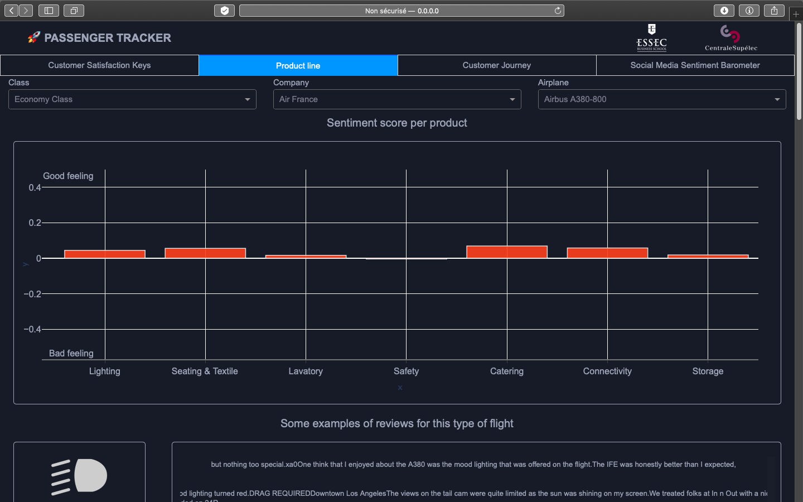
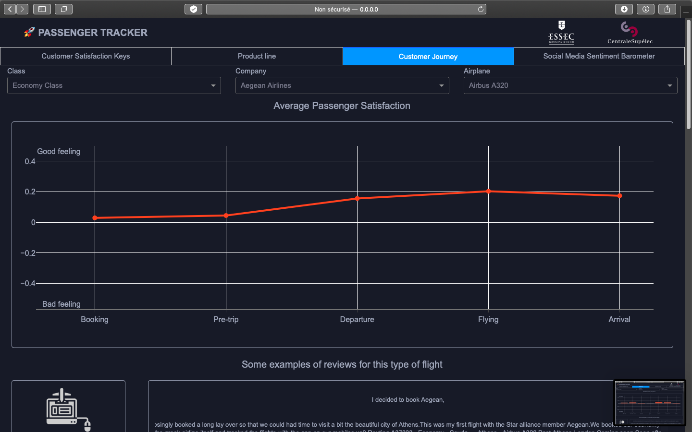
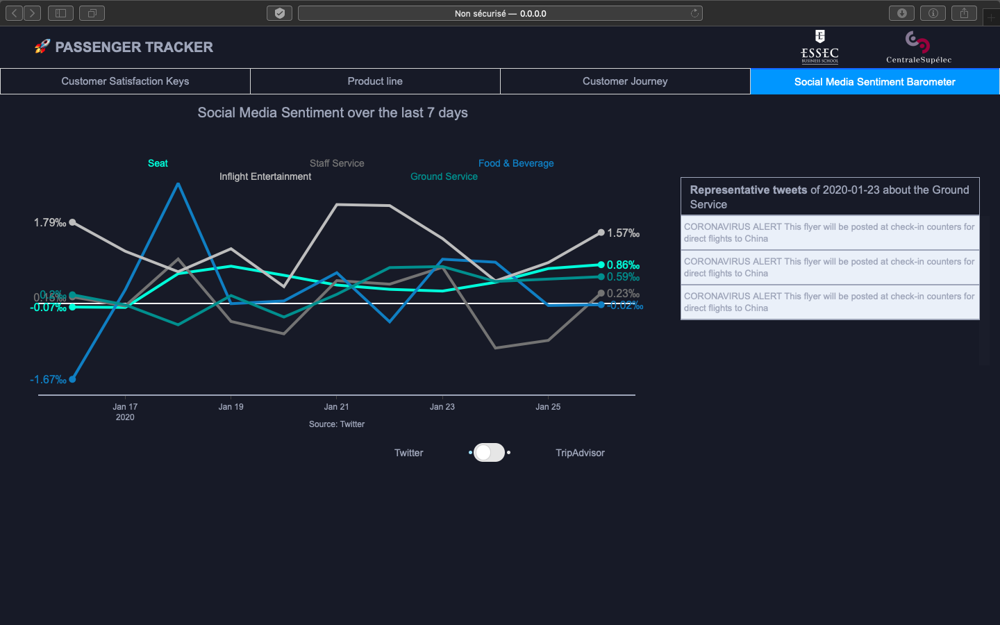

# 🚀 PassengerTracker
_Airline customer satisfaction tracker through NLP sentiment analysis from the web_

## BUSINESS INSIGHTS
  Story telling: Given circumstances (weather, delays, snowball effects...) and stakes held by flight travels (pressure on time, holidays, stress, family visits, children, elderly, disabled...), airline companies face fierce retaliations from customers online. Some events often go viral and threaten a whole company's reputation in a blink (for example, passenger expelled from a Delta airplane). That makes a case of strategic importance for airline companies to take the pulse of customer satisfaction in real time in order to take adequate operational actions proactively, rather than reactively.

  The idea is to conceive (and not necessarily develop given the time) a dashboard for the airline company's Customer experience team. A sort of PassengerTracker similar to the FlightTracker where customers check for flights.  

  Some basic visualizations of the distribution of reviews with respect to topics and sentiment.

  For example, display top 5 and flop 5 reviews regarding the topic "seat".

  For each of the top and flop, we can deepdive to see the route ('Paris to Madrid' for example), the aircraft and the date and even read the reviews to understand the claims better.

  Plot the sentiment for the topic 'seat' and 'catering' over time. The idea is to place tresholds as red flags for the management team when things go wrong.

  Plot the top and flop performing routes and aircrafts to check for patterns. If, for example, the 'Paris to Madrid' route is consistently performing poorly, the management team will be incentivized to look into the issue.

## ROADMAP
- Step 1 - Web Scraping
- Step 2 - Text Processing
- Step 3 - Modelling
- Step 4 - Recommendations

## Step 1 - Web Scraping
### Sources
- https://www.airlinequality.com/
- https://skytraxratings.com/airlines
- https://www.tripadvisor.com/Airlines

## Step 2 - Text Processing
### Which embedding for our dataset?
### Which language model for Transfer Learning?

## Step 3 - Modelling
### Topic Modelling

#### Use *topic_scoring.py*
*file path: /03_NLP/Topic_scoring/topic_scoring.py* 

You need to install these libraries from the terminal, check on the topic_scoring if you miss some.
It can take time because it downloads english language
```
pip install pandas
pip install numpy
pip install spacy
pip install nltk
```

Like any library, use :
````
from topic_scoring import sentence_extraction_scoring, dict_topics
````
It will import all the libraries of the script. Because of nlp library it can last quite long.
An initial dictionnary of topics with related words is already written down.

To use the function with your dataframe reviews:
##### It returns your dataframe with list of sentences related to each topic (TOPIC_sentences) and the related score (TOPIC_score)

`````
df_results = sentence_extraction_scoring(df, dict_topics, column_name='review')
`````
- df : your dataframe
- dict_topics : dictionnary of topics with related words (loaded with the script)
- column_name : the name of your review header (default='review)

### Sentiment Analysis

## Step 4 - Recommendations
### Business Intelligence dispay: Dashboard prototype

#### Built With
* [Dash](https://dash.plot.ly/) - Main server and interactive components 
* [Plotly Python](https://plot.ly/python/) - Used to create the interactive plots
* [Dash DAQ](https://dash.plot.ly/dash-daq) - Styled technical components for industrial applications
* [CSS template](https://github.com/plotly/dash-sample-apps/tree/master/apps/dash-medical-provider-charges/assets) - CSS templace that inspired us

#### Requirements
We suggest you to create a separate virtual environment running Python 3 for this app, and install all of the required dependencies there. Run in Terminal/Command Prompt:

```
git clone https://github.com/SapiensZ/PassengerTracker.git
cd PassengerTracker/04_Dashboard/
python3 -m virtualenv venv
```
In UNIX system: 

```
source venv/bin/activate
```
In Windows: 

```
venv\Scripts\activate
```

To install all of the required packages to this environment, simply run:

```
pip install -r requirements.txt
```

and all of the required `pip` packages, will be installed, and the app will be able to run.


#### How to use this app

Run this app locally by:
```
python app.py
```
Open http://0.0.0.0:8050/ in your browser, you will see a live-updating dashboard.

#### Screenshot







